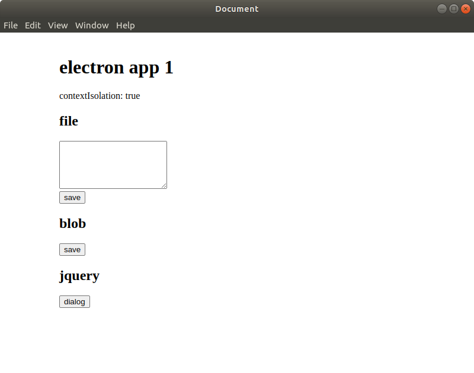

# Electron Save Files

Electron example to test **contextIsolation** differences in a similar application that have access to filesystem and import a JavaScript library

* App1

    contextIsolation: true

* App2

    contextIsolation: false

## Features

* Save file to filesystem
* Save blob to filesystem
* Test jquery dialog

## Usage

Modify *main* property in *package.json* to start app1 or app1

```
npm install
npm start
```

## Screenshots

